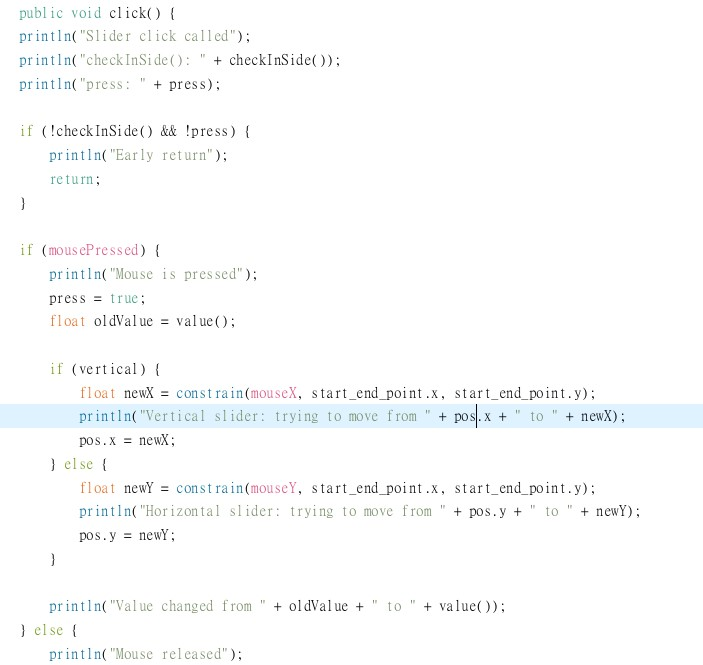

### 1. make Translation, rotation, scale.
I try to implement but I failed, the slider will freeze and I try many ways to fix it, but still not work. Here's the process I've done in these weeks.
>code snippets

I followed the reasoning I learned in class. What I learned in class was a 3x3 translation matrix in the x and y directions, but now the implementation involves a 4x4 matrix in the x, y, and z directions. So I wrote the following code.
```
(1) makeTrans()
m[0] = 1.0f ;  m[1]  = 0.0f ; m[2]  = 0.0f;  m[3]  = s.x;
m[4] = 0.0f ;  m[5]  = 1.0f ; m[6]  = 0.0f;  m[7]  = s.y;
m[8] = 0.0f ;  m[9]  = 0.0f ; m[10] = 1.0f;  m[11] = s.z;
m[12] = 0.0f ; m[13] = 0.0f ; m[14] = 0.0f;  m[15] = 1.0f;

(2) makeRotZ()
m[0] = cos(a) ; m[1]  = -sin(a) ; m[2]  = 0.0f;  m[3]  = 0.0f;
m[4] = sin(a) ; m[5]  = cos(a) ;  m[6]  = 0.0f;  m[7]  = 0.0f;
m[8] = 0.0f ;   m[9]  = 0.0f ;    m[10] = 1.0f;  m[11] = 0.0f;
m[12] = 0.0f ;  m[13] = 0.0f ;    m[14] = 0.0f;  m[15] = 1.0f;

(3) makeScale()
m[0] = s.x ;   m[1]  = 0.0f ; m[2]  = 0.0f;  m[3]  = 0.0f;
m[4] = 0.0f ;  m[5]  = s.y ;  m[6]  = 0.0f;  m[7]  = 0.0f;
m[8] = 0.0f ;  m[9]  = 0.0f ; m[10] = s.z;   m[11] = 0.0f;
m[12] = 0.0f ; m[13] = 0.0f ; m[14] = 0.0f;  m[15] = 1.0f;
```
But I found that the slider freeze, so I ask ChatGPT, he think I can add some debug message. 
 - add **try** and **catch** in 3 function.
 - add message in **Slider.click()** to check the mouse is inside or not.
 
Here's the change I've done and the console message I get.
 - matrix part

 - slider part

 - debug message


From the result, I can see that The slider detected the click, but thought that the mouse was not within the range of the slider, so it returned early. And the matrix does change, but the small button inside the slider still can't move. So I try to make the button bigger, and the slider thinner, like this :


Is the same result, it does not work. Then I go **back to the matrix** I wrote because the slider freeze after I implement those 3 function, I decided to write the result of multiplying the three matrices in **localWorld** to test it.
Here's the original one :


I change it like this :
```
 Matrix4 finalMatrix = new Matrix4();
   
 finalMatrix.m[0] = s.x * cos(theta);
 finalMatrix.m[1] = -s.y * sin(theta);
 finalMatrix.m[2] = 0;
 finalMatrix.m[3] = t.x;
    
 finalMatrix.m[4] = s.x * sin(theta);
 finalMatrix.m[5] = s.y * cos(theta);
 finalMatrix.m[6] = 0;
 finalMatrix.m[7] = t.y;
    
 finalMatrix.m[8] = 0;
 finalMatrix.m[9] = 0;
 finalMatrix.m[10] = s.z;
 finalMatrix.m[11] = t.z;

 finalMatrix.m[12] = 0;
 finalMatrix.m[13] = 0;
 finalMatrix.m[14] = 0;
 finalMatrix.m[15] = 1;
```
Still don't work. 
Then I ask TA after class, it's clearly that The problem lies in the way I write the matrix, for the **makeatrans** function, the last column should be zero because it is output, so I change it like this:
 ```
m[0] = 1.0f ;  m[1]  = 0.0f ; m[2]  = 0.0f;  m[3]  = s.x;
m[4] = 0.0f ;  m[5]  = 1.0f ; m[6]  = 0.0f;  m[7]  = s.y;
m[8] = 0.0f ;  m[9]  = 0.0f ; m[10] = 1.0f;  m[11] = s.z;
m[12] = 0.0f ; m[13] = 0.0f ; m[14] = 0.0f;  m[15] = 0.0f;
```
and it freeze as usual, So try to take these three out and **test them separately**, it means that the localWorld will return only one matrix.
the code will look below (same as rotation and scale):


The result doesn't succeed, my debug messages stop the moment I pull the mouse (the slider does not move with my mouse).
Any way, I try many method the solve it, but the result still don't work as I expected.

>How I complete this part

I see the note I write in class, with some online information to ensure my note is right, and I ask ChatGPT, Claude to help me with this homework, I also ask TA for help. Although I fail to implement this task, I did my best.
I leave my homework like this.


### 2. Fill the color of polygon.
I've implement two function in this part.
>code snippets & Algorithm

(1) pnpoly function
This function uses the **Ray Casting Algorithm** to determine whether a point is inside the polygon:


**Main algorithm**
1. First I do a basic check to make sure the polygon has at least 3 vertices


2. Then I emit a horizontal ray to the right from the point to be measured
3. Record the number of intersections of this ray with the polygon edges
   - Use (yi > y) != (yj > y) to determine whether the edge may intersect the ray
   - Calculate the actual intersection position using 
   x < (xj - xi) * (y - yi) / (yj - yi) + xi


4. If the number of intersection points is an odd number, the point is inside the polygon; if it is an even number, the point is outside the polygon.


**Key mathematical principles**
- Use the concept of vector cross product to determine the relative position of points and edges
- Determine internal and external relationships through even-odd rules

(2) findBoundBox function
This function calculates the **Axis-Aligned Bounding Box (AABB)** of the object:

**Main algorithm**
1. Initialization considers boundary conditions and returns the default value when the vertex array is empty.


2. Set the coordinates of the first vertex to the initial minimum and maximum values


3. Traverse all vertices and update the minimum and maximum values ​​of the three axes:
   - x-axis: record minimum x and maximum x
   - y-axis: records minimum y and maximum y
   - z-axis: records minimum z and maximum z


4. Return an array containing the minimum and maximum points


**Key technical**
- Use Greedy Algorithm to find the extreme value of each axis
- The position and size of the entire bounding box can be determined through two vertices (minimum point and maximum point)

>Demo Screenshot

You can see the polygon is filled with color.


>How I complete this part

I ask ChatGPT to enter the website that given in the HackMD，and according to the architecture in the homework, I ask it to fill the code.

### 3. Keep the polygon inside the canvas

Since the first task in this homework is failed, I cannot test this algorithm is right or wrong. So I just write it as I thought.
>code snippets & Algorithm

The algorithm works by iteratively processing each edge of the clipping boundary and "clipping" the polygon against each edge. The result is a new polygon that lies inside the clipping boundary.
1. Iterating Over Each Boundary Edge
 - For each boundary edge, I clear the output list, since it will hold the clipped polygon for this specific boundary edge.


2. Processing Polygon Vertices
 - processes each vertex in the current polygon (input). Each vertex is checked relative to the current clipping edge.
 - currentPoint refers to the current vertex, and prevPoint is the previous vertex in the polygon.


3. Checking Whether a Point is Inside or Outside the Clipping Boundary
 - Inside/Outside Determination: This code calculates the "side" of the clipping edge that each point lies on.
 - The currentSide and prevSide variables are the results of a 2D cross product that determines if the points are to the left or right of the clipping edge.
 - If the result is positive, the point is to the left (inside the clipping region), and if it is negative, the point is to the right (outside the clipping region).
 - The algorithm assumes the clipping boundary is convex and that "inside" means to the left of each edge (or the specified inside direction).


4. Handling Different Cases (Inside and Outside Points)
 - If the current point is inside the boundary (i.e., currentSide <= 0), we simply add it to the output polygon.
 - If the previous point was outside the boundary (i.e., prevSide > 0), we compute the intersection between the previous edge and the clipping edge.
 - If the current point is outside the boundary (currentSide > 0), but the previous point is inside (prevSide <= 0), we compute the intersection point between the current edge and the clipping boundary and add the intersection to the output polygon.


5. Calculating the Intersection Point
  - If there is an intersection between the clipping edge and the current polygon edge, this code calculates the intersection point using a system of linear equations derived from the line equations of both the polygon edge and the clipping edge.
 - The determinant det is calculated to avoid dividing by zero (which could occur if the two lines are parallel).
 - The intersection point is calculated and added to the output.


6. Preparing for Next Iteration
  - After processing all the vertices against one clipping edge, the output list (which now contains the clipped polygon) becomes the input for the next iteration (for clipping against the next boundary edge).


7. Returning the Final Clipped Polygon


>How I complete this part

I ask Claude and ChatGPT as well, and I also ask it to explain the step he give it to me.
