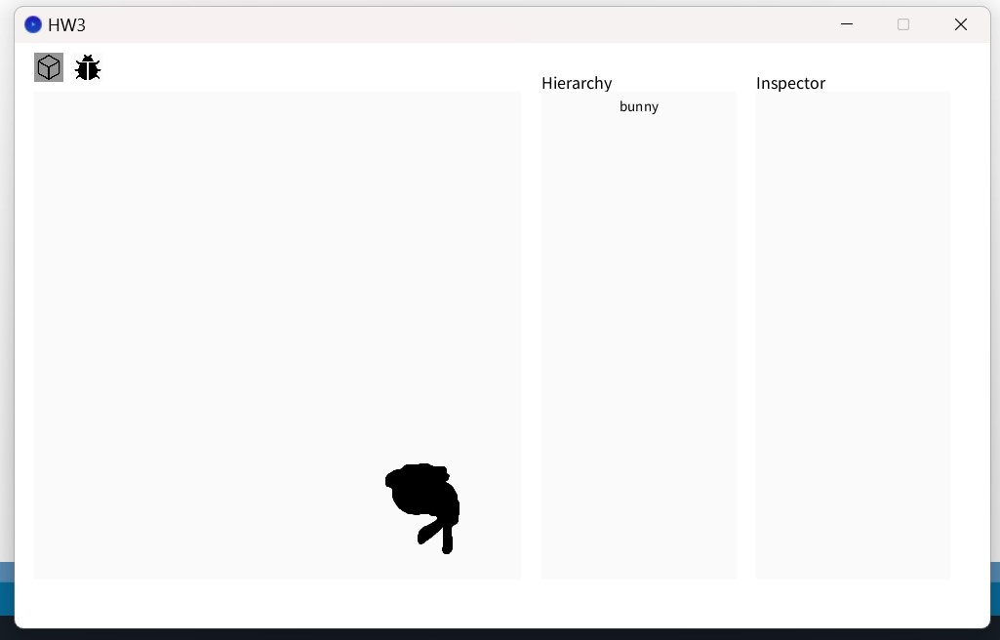

#### which tasks I have completed
##### 1. Successfully make the object rotate.
I implement **makeRotY** and **makeRotX** function, for this part, I just search for the matrix online and write it. And I also implement the **localToWorld()** function, I write it in the Translation -> Rotation -> Scale oder, and multiple all the matrix.
>code snippets

This is the matrix I implement.

This is the multiple of all movement.

>demo image

Here are some demo image of cube object.

And here is the bunny object.

##### 2. depth buffer.
>code snippets

>demo image

##### 3. camera control.
I use **keyboard** to control the object, making it move by typing six letters. Upper case and Lower case doesn't matter. At the top of the function, I add a variable called **cameraSpeed** to control the speed of the movement.
(1) For **Z-axis**
I use letter "w" to control object move forward, and "s" for backward.
(2) For **X-axis**
"a" and "d" is for x-axis, which stands for moving left and right.
(3) For **Y-axis**
Same as above, "q" and "e" is for y-axis, which stands for moving upward and down.
>code snippets

>demo image

This is the demo image when I press "w". You can see it's bigger.

Then I press "d" after. You can see it move right.

Then I press "e" to make the bunny object move down.

##### 4. backculling.

>code snippets

>demo image

